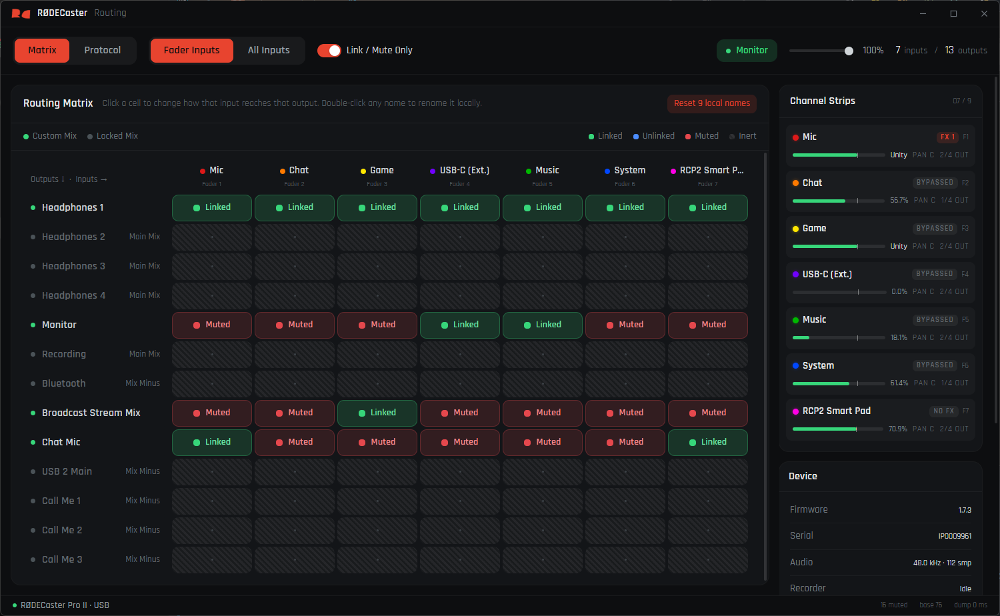

<div align="center">

# RØDECaster Routing

**The RØDECaster Pro II routing matrix as a grid, instead of a menu dive.**

[](LICENSE)
[](https://tauri.app)
[](https://nuxt.com)
[](https://www.rust-lang.org)



</div>

## Disclaimer

**This project is not affiliated with RØDE Microphones, or any of its
employees.** It is not endorsed, sanctioned or supported by them. "RØDECaster"
and "RØDE" are their trademarks, used here only to say what this software talks
to.

**This is unofficial.** It was built by watching how the console and RØDE's own
software already talk to each other, so nothing about that conversation is
documented or promised. RØDE may change it in any firmware update, without
notice, and nothing here is guaranteed to keep working.

**It can go wrong.** The app sends only commands it has seen the console accept
already, but this is not a documented control interface and writing to one
carries real risk. A malformed or mistargeted command could leave the console
in a state needing a factory reset, or a firmware reflash to recover. That risk
is highest when developing against the device rather than running the app as
built.

Use it at your own risk. If your console matters to your work, understand that
before you point this at it.

## What it does

The console can send any input to any output, but changing one of those
connections means walking into a menu on the touchscreen and back out again.
This puts the whole grid on screen instead.

The list of what it does includes, but is not limited to:

- **Routing matrix**
  - The whole grid on one screen, changing a cell with a click
  - Tri-state cells, matching what the console stores: following the main
    fader, present at an independent level, or absent from that output
  - Per-cell levels for the inputs that are not following the main fader
  - Per-output mode (Main Mix, Mix Minus or Custom), with cells on the first
    two marked inert, since those modes carry every channel whatever the cell
    says

- **Channel strips**
  - Level, mute, pan, cue, talkback, processing bypass and FX preset
  - Per-source colour, editable from the strip, offering the sixteen colours
    the console will accept and no others

- **Device**
  - Studio monitor mute and volume, which the RØDECaster App does not expose
  - Live updates, including changes made on the hardware or in the RØDECaster
    App

- **Also**
  - Local renaming of any input or output, since the console stores no names of
    its own, kept on your machine and never written to the device
  - A protocol log of frames in both directions, for working on the app itself
  - Optional start with the desktop

## How it talks to the console

The console exposes a vendor-specific HID interface alongside its audio, MIDI
and storage ones. That interface is bidirectional and carries the control
protocol. This app uses only that interface, and touches nothing else.

**Reading is a single request, then a subscription.** On connect the app asks
once for the console's state. The console answers with all of it, roughly
136 KB, split across hundreds of USB reports that have to be reassembled in
order. That one reply establishes the whole picture: the matrix, the strips, the
device details.

After that the app listens. **The console announces every state change on its
own**, whoever caused it, so a fader moved on the hardware, a cell changed in
the RØDECaster App, and a click in this app all arrive the same way. The app
follows that stream and patches the one thing that changed.

**It never polls.** Asking repeatedly would put 136 KB on the wire for each
answer to learn nothing most of the time. One read on connect, then events.

**Writing is per operation.** The device handle is opened for the length of a
single command and closed again, so this app and the RØDECaster App can be open
at the same time without fighting over the interface.

**Addresses come from the console, not from constants.** Objects are numbered by
their position in the state dump, so the numbers shift on hardware with a
different mix of inputs and outputs. The app reads them out of each dump rather
than assuming the values seen on one unit, and refuses to address anything if
the dump does not check out internally.

## Supported hardware

| Device | Status |
|---|---|
| RØDECaster Pro II | Developed and tested against |
| RØDECaster Duo | Should address correctly, **untested** |

Because addresses are read from the dump, a Duo should be addressed correctly
despite having fewer outputs. Its inputs and outputs will show as `source N` and
`Output N`, since the names come from a table that only covers the Pro II.

That row is likely to stay untested for a while. Everything here was built
against a Pro II, which is the only console on hand, and a Duo sits a little
beyond the hobby budget. If you have one, hearing whether it works, or how it
falls over, would be genuinely welcome.

## Getting started

You need [Rust](https://rustup.rs), [Node](https://nodejs.org) and
[pnpm](https://pnpm.io), plus the
[Tauri prerequisites](https://tauri.app/start/prerequisites/) for your platform.

```bash
git clone https://github.com/Holfz/rodecaster-routing
cd rodecaster-routing/ui
pnpm install

pnpm app          # run it
pnpm app:build    # build an installer
```

The scripts run from `ui/` and invoke Tauri from the repository root, which is
where it looks for `src-tauri/`.

## Layout

```
crates/
  rcp-proto/      frame layout, value types, the state-dump parser
  rcp-model/      routing matrix, labels, commands
  rcp-transport/  USB HID
src-tauri/        Tauri backend
ui/               Nuxt 4 and Nuxt UI 4 frontend
```

`rcp-proto` has no dependencies, so the wire format and its tests build without
any platform I/O.

## Contributing

Yes please, and thank you for looking. Bug reports, fixes, ideas, and most of
all a word from anyone running this on hardware it has never seen.

Fair warning that this is a hobby project built in spare evenings, so there is
no roadmap and no support promise. If a reply takes a while, or never quite
arrives, it is nothing personal. Forking is genuinely fine too, no hard
feelings.

Two things are worth knowing before you open a pull request, because this moves
somebody's live audio:

**Please do not guess a label or an address.** A source the evidence cannot name
stays unnamed and shows up as `source N`. That looks unfinished, and it is the
right answer anyway: a confident wrong name sends audio somewhere nobody
intended, which is worse than no name at all.

**Writes need evidence.** Every command here reproduces bytes actually seen on
the wire. If you want to add one, capture it first rather than building it from
a property name that looks plausible.

One habit that saves a lot of time: the console reports state *changes*, not
writes, so a command that lands silently tells you nothing about whether the
address was right. Check against a fresh state dump instead of the RØDECaster
App's display, which does not refresh from changes it did not make itself.

If any of that is unclear, ask. A question is cheaper than a wrong guess
reaching somebody's console.

## Licence

MIT. See [LICENSE](LICENSE).
